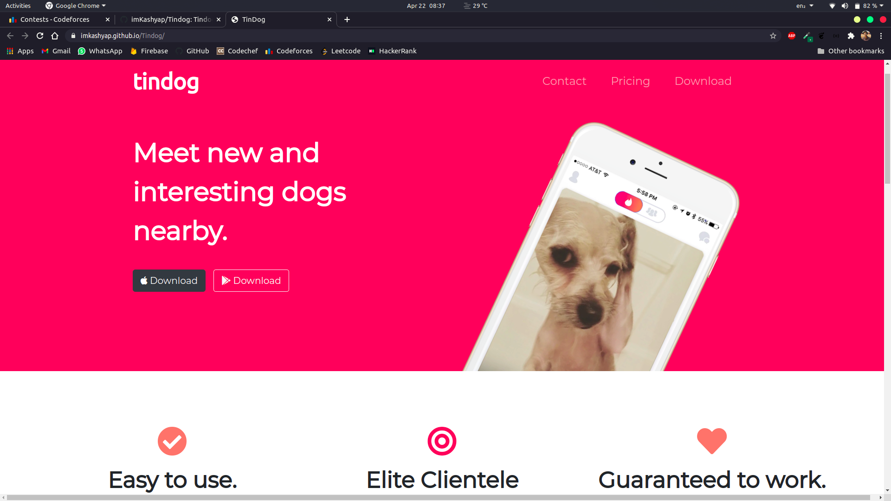
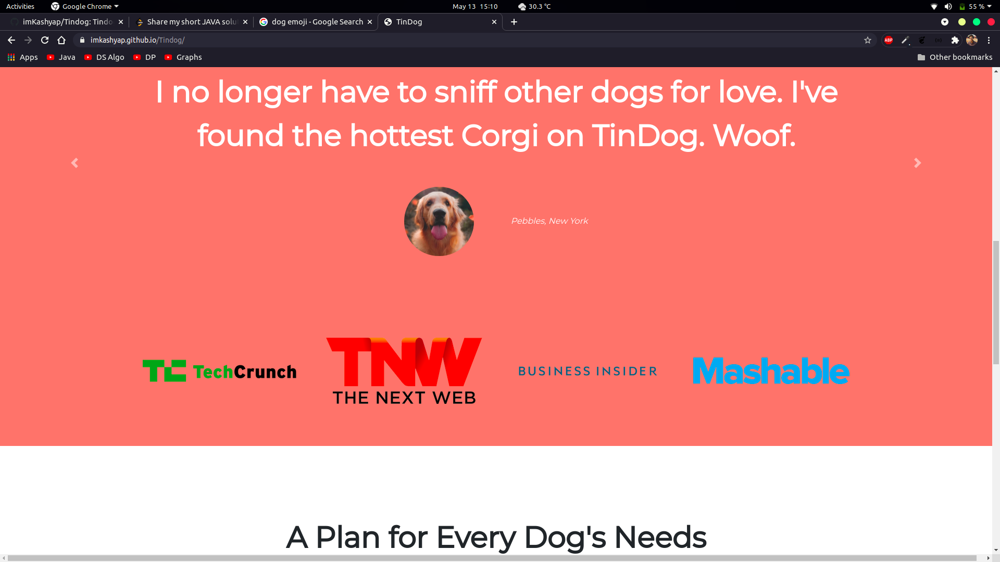
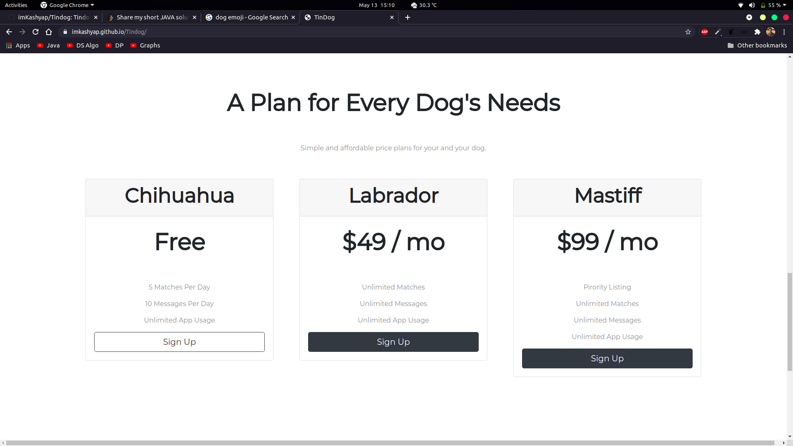

<h1 style="text-align:center;">Tindog 🐶</h1>
  
  [](https://opensource.org/licenses/MIT)

- **Tindog** is a tinder application for Dogs.
- This website hosts all information related to Tindog including the prices, testimonials and contact info.
- The app is developed in HTML & CSS only. Bootstrap is used as a framework for CSS.
- Try the website [here.](https://imkashyap.github.io/Tindog/)
  

  ***


## Table of Contents
- [Table of Contents](#table-of-contents)
- [Screenshots](#screenshots)
- [Getting Started](#getting-started)
- [License](#license)

***

## Screenshots
|Screen Name | Screenshots |
|---|--|
|Landing Page||
|Testimonials Page||
|Prices Page||

***

## Getting Started
Clone the repository on your local machine.

```bash
git clone git@github.com:imKashyap/tindog.git
```

Run `index.html` file on a live server or any browser and make sure you see the following screen:


## License
 This repository is licensed under [MIT.](https://github.com/imKashyap/tindog/blob/main/LICENSE)
 
 Do fork and star :star: the repo if you find it appreciable.
